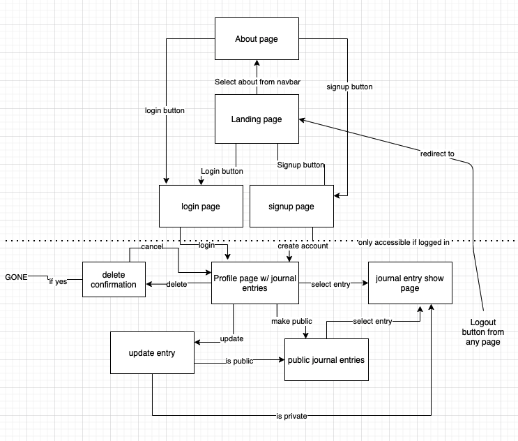

# Dreamscribe

=== OVERVIEW ===

=== Overall Concept === 

Do you have vivid dreams at night? Do you every have the urge to write down your dreams so you can remember them later? Are you a lucid dreamer, or would like to begin a practice of lucid dreaming? Welcome to Dreamscribe, a repository for individuals to journal their dreams and access resources for lucid dreaming techniques. The dream entries are private by default, but can be made public and shared on the main feed. Sign up and start recording your dreams today with Dreamscribe!

=== Link to site ===

You can access Dreamscribe and begin recording your dreams here:

https://dreamscribe.herokuapp.com/ 

=== Developer Installation ===

To install this application on your local machine, fork and clone down the repo. 

You will need node.js to run this application on your local machine. Run "npm install" to download all dependencies for the application.

Once all dependencies are downloaded, you should be able to spin up the application with "node server.js". 

=== Main Technologies ===

- JS
- Node
- Express
- Mongoose
- MongoDB 
- EJS 
- SASS 
- jQuery

=== Pictures of Site ===

=== DEVELOPMENT ROADMAP ===

=== Sprints ===

SPRINT 1: Set-up
- Set up server - DONE
- Set up folder structure - DONE
- Set up logger and other useful middleware - DONE
- Outline journal entry routes + verify they work w/ res.send() - DONE
- Outline user auth routes + verify functionality - DONE

SPRINT 2: Templates
- Create template outlines for all pages: - DONE
- Connect these show pages to routes - DONE
- Create and replace repetitive code with EJS partials -DONE
- Set up SASS - DONE
- Add basic styling necessary for core functionality - DONE
- Add needed event listeners for Navbar, etc. - DONE

SPRINT 3: Database
- Set up MongoDB connection w/ mongoose - DONE
- Create and outline models  - DONE

SPRINT 4: Full CRUD 
- Fill in route outlines for journal entries to have full CRUD - DONE
- Update forms in templates to have CRUD work for journal entries - DONE

SPRINT 5: User Auth
- Fill in route outlines for auth - DONE
- Update forms in templates to have working auth - DONE
- Make login required for certain functionality, including: - DONE
- Viewing profiles - DONE
- Creating, updating, or deleting comments/posts - DONE
- Making CRUD only work for own posts -DONE

SPRINT 6: Error Handling/Bugs 
- Extensive checking to make sure all errors are handled properly and display on the page - DONE
- Add data validation to ensure auth functions properly - DONE
- Iron out any bugs in functionality - DONE

SPRINT 7: Level Up Styling 
- Finish up any padding, margin, or spacing issues -  DONE
- Finish up any DOM manipulation - DONE
- Make navbar dynamic - DONE
- Add color scheme + color variables - DONE
- Add appropriate font - DONE
- Add appropriate images - DONE
- Add animations/transitions/hover effects - DONE
- Round out styling with minor changes to border radius, shadow, or any other nice looking things - DONE

SPRINT 8: Refactor code
- Refactor public files - DONE
- Refactor backend files - DONE
- Remove unnecessary files - DONE
- Remove all code that is not production ready - DONE

SPRINT 9: Deployment  
- Setup MongoDB atlas and connect to site - DONE
- Deploy to Heroku - DONE

=== Future Goals ===
- Comments so users can interact with one another - In Progress
- Captcha on signup to avoid spam account
- Refactor pages for update/delete to modals
- Auto-mod to prevent unnecessary hostile language appearing in posts/spam
- Admin privileges that can be granted to certain users so they can mod website
- Profile settings page with options for users to change how their information is displayed or delete their profile
- Lucid dreaming challenge generator that users can refresh
- Badges for completing challenges that are displayed on profile
- File upload system so users can upload their dreams or pictures of their dreams
- Some system for allowing the file upload system to not be abused
- The ability for users to mark a journal entry as explicit so it is blurred and can only be accessed if logged in and clicked on
- Another feed using the same create/update/destroy routes, but is for questions about lucid dreaming - add Q and A feed
- Add the ability for users to add resources to the resources page
- The ability to dictate dreams with voice to text

=== PLANNING MATERIALS ===

=== User Stories ===

Upon visiting the site, users see a landing page with a brief overview of the site's purpose and links to resources/sleep-science and sign up. The navbar at the top has links to an about page, resources page, login, and sign up. Clicking on the name of the site brings the user back to this homepage. 

Clicking the about button will take the user to a page with a more detailed description of the site, why the site was created, and a short bio of the site creator. 

Clicking the signup button or login button will take the user to a page requesting their user information to either sign-up or login. Each page will have a link at the bottom that links to the other page. Once a user signs up or logs in, they will be redirected to their profile.

A user’s profile will consist of their username and profile photo/avatar, as well as all the journal entries they have created (newest first). There is a search bar at the top of the page to make accessing different entries easier. There is also a create button for creating private journal entries. 

The journal feed page has all public dream journal entries. Like the profile page, it also has a create journal entry button and a search bar. Journal entries created here will be public by default. Users can select individual posts by clicking the card and are redirected to the show page for that entry.

The journal show page has the journal entry at the top of the page and all comments for that journal entry beneath it. The user has buttons to select whether to update the entry, delete the entry, or make it public.

Selecting a create or update button brings the user to one of the forms to create or update the journal entry. Update pages have the users information saved so it is easily updatable. 

Clicking the logout button in the navbar will log the user out and return them to the homepage. 

=== ERD ===

=== USER FLOW DIAGRAM ===

=== WireFrames ===

